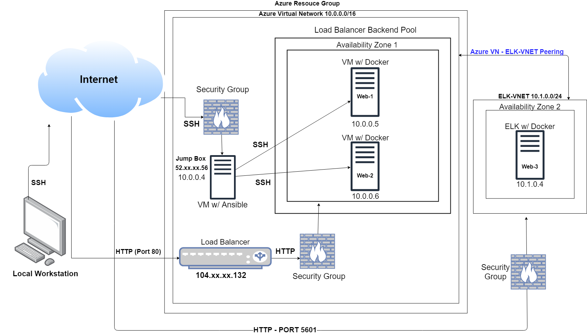

# Automated ELK Stack Deployment

This is a write-up demonstrating a project where I built a cloud-based solution that uses the ELK stack to monitor two vulnerable web applications.

The files in this repository were used to configure the network depicted below.



These files have been tested and used to generate a live ELK deployment on Azure. They can be used to either recreate the entire deployment pictured above. Alternatively, select portions of the Ansible Playbook file may be used to install only certain pieces of it, such as Filebeat.

I have put all my YAML files in the Ansible folder below which contains my Playbooks used in the deployment. You will find an Ansible Playbook, an ELK installation playbook, a Filebeat installation playbook and a Metricbeat installation playbook.

[Ansible Playbooks](Ansible)

This document contains the following details:
- Description of the Topology
- Access Policies
- ELK Configuration
  - Beats in Use
  - Machines Being Monitored
- How to Use the Ansible Build


### Description of the Topology

The main purpose of this network is to expose a load-balanced and monitored instance of DVWA, the D*mn Vulnerable Web Application.

Load balancing ensures that the application will be highly available, in addition to restricting high traffic loads to the network.

What aspect of security do load balancers protect? 
 - Load balancers help prevent overloading servers as well as optimizing productivity and maximizing uptime. It also adds resiliency by rerouting live traffic across multiple servers allowing it to eliminate single points of failure from attacks such as DDoS attacks.

What is the advantage of a jump box?
 - A jump box serves as a gateway to gain entry into a remote network. Often the primary mode of access is SSH and without the private key, access is forbidden, making this a secure option for your network.

Integrating an ELK server allows users to easily monitor the vulnerable VMs for changes to the network and system logs.

What does Filebeat watch for?
- Filebeat monitors and watches for log files or locations you have specified, collects log events, and forwards them either to Elasticsearch or Logstash. This is useful if you are following a security trail and need to know where it ends up.

What does Metricbeat record?
- Metricbeat will periodically record metrics from the operating system and from services running on the server. Metricbeat takes the metrics and statistics that it collects and sends them to an output such as Elasticsearch or Logstash.

The configuration details of each machine may be found below. 

| Name     | Function | IP Address | Operating System |
|----------|----------|------------|------------------|
| Jump Box | Gateway  | 10.0.0.4   | Linux (ubuntu 20.04) |
| Web-1    | Web Server | 10.0.0.5 | Linux (ubuntu 20.04) |
| Web-2    | Web Server | 10.0.0.6 | Linux (ubuntu 20.04) |
| Web-3    | ELK Stack | 10.1.0.4 | Linux (ubuntu 20.04) |

### Access Policies

The machines on the internal network are not exposed to the public Internet. 

Only the Jump Box can accept connections from the Internet. Access to this machine is only allowed from the following IP addresses:
- My public IP: 1.xx.xx.166

Machines within the network can only be accessed by the Jump Box (Gateway).
- Jump Box IP's:
	- Public IP: 40.xx.xx.234
	- Private IP: 10.1.0.4

A summary of the access policies in place can be found in the table below.

| Name     | Publicly Accessible | Allowed IP Addresses |
|----------|---------------------|----------------------|
| Jump Box | Yes - SSH - 22      | 1.xx.xx.166 - My Public IP |
| Web-1    | No                  | 10.0.0.4 - Private IP |
| Web-2    | No                  | 10.0.0.4 - Private IP |
| Web-3 (ELK) | No - TCP - 5601 | 10.0.0.4 - Private IP, 1.xx.xx.166 - My Public IP |

### Elk Configuration

Ansible was used to automate configuration of the ELK machine. No configuration was performed manually, which is advantageous because it becomes a time saver and reduces user error. You are able to use the playbook to run a whole list of tasks which automatically configures your ELK and ensures it was setup correctly.

The playbook implements the following tasks:
- Installs `docker.io`
- Installs `python3-pip`
- Installs `docker`, which is the Docker Python pip module
- Increases the virtual memory so the ELK container can run
- Download and launch a docker elk container `sebp/elk:761` with ports `5601` `9200` `5044` open and ensures the restart policy for the container is set to always
- Enables `docker` service on boot

The following screenshot displays the result of running `docker ps` after successfully configuring the ELK instance.


### Target Machines & Beats
This ELK server is configured to monitor the following machines:

- Web-1 - 10.0.0.5
- Web-2 - 10.0.0.6

We have installed the following Beats on these machines:

- Metricbeat
- Filebeat

These Beats allow us to collect the following information from each machine:

- **Filebeat** - Filebeat is designed to ship or track log files by offering a lightweight way to forward and centralize your logs and files. For example, you can track all audit files with the flag `access_denied` which sends logs when an authenticated user attempts to execute an action they do not have the necessary privilege to perform.
- **Metricbeat** - Metricbeat periodically collect metrics from the operating system and from services running on the server, such as CPU, load, memory usage, processes or network. For example, you can utilize the anomaly detector `max_disk_utilization_ecs` which detects unusual increases in disk utilization.

### Using the Playbook

In order to use the playbook, you will need to have an Ansible control node already configured. Assuming you have such a control node provisioned: 

SSH into the control node and follow the steps below:
- Copy the `elk-install-playbook.yml` file to `/etc/ansible`.
- Update the hosts file to include your web server and ELK IP addresses:
```console
[webservers]
10.0.0.5 ansible_python_interpreter=/usr/bin/python3
10.0.0.6 ansible_python_interpreter=/usr/bin/python3

[elk]
10.1.0.4 ansible_python_interpreter=/usr/bin/python3
```
- Run the playbook, and navigate to ```http://40.xx.xx.234:5601/app/kibana``` to check that the installation worked as expected.

### Creating a playbook and running commands on the Ansible node

This is a step by step of creating your playbook for proper configuration and installation of your ELK instance.

- Move into your /etc/ansible directory and create a new playbook titled "elk-install-playbook.yml" and copy in what I have provided in the YAML file to install ELK and save.

```cd /etc/ansible```
```nano elk-install-playbook.yml```
- Then open the hosts file and add in your new VMs as hosts:  
 
```nano hosts```

```console
[webservers]  
10.0.0.5 ansible_python_interpreter=/usr/bin/python3  
10.0.0.6 ansible_python_interpreter=/usr/bin/python3  
[elk]  
10.1.0.4 ansible_python_interpreter=/usr/bin/python3
``` 
- run the Ansible playbook command and let it install:  

```ansible-playbook elk-install-playbook.yml```

- Once completed confirm the ELK stack has been deployed and is running on the public IP address of your ELK VM with port 5601 (you must allow this as a rule in your NSG to connect) by running the following in your browser:  
```http://[your.VM.IP]:5601/app/kibana```

### Script example
This folder below provides an example of a Linux script I made which will run a quick system audit.

[Linux Script](Linux)
